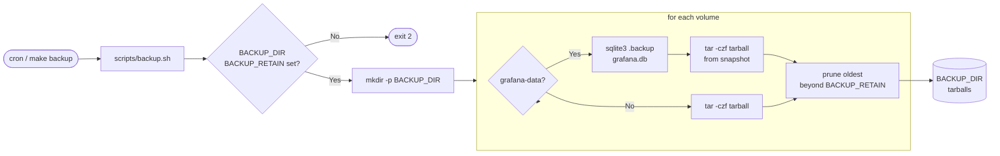

# Backup Flow — opentelemetry

Flujo completo de un ciclo de backup: desde el disparador externo (cron o make) hasta los tarballs finales en `BACKUP_DIR` con retención aplicada.

## Notas

- El bucle intenta los 4 volúmenes (`tempo-data`, `loki-data`, `prometheus-data`, `grafana-data`) incluso si uno falla; el script acumula el error y retorna código `1` al final.
- El side-car es `alpine:3.19` one-shot (`docker run --rm`). El volumen fuente se monta `:ro`; `BACKUP_DIR` se monta `:rw`.
- La retención es **por volumen**, no global — `ls -1t <vol>-*.tar.gz | tail -n +$((BACKUP_RETAIN+1)) | xargs -r rm`.
- El paso `sqlite3 .backup` usa el SQLite Online Backup API: escribe a un archivo destino fresco sin necesitar write-access al volumen fuente.
