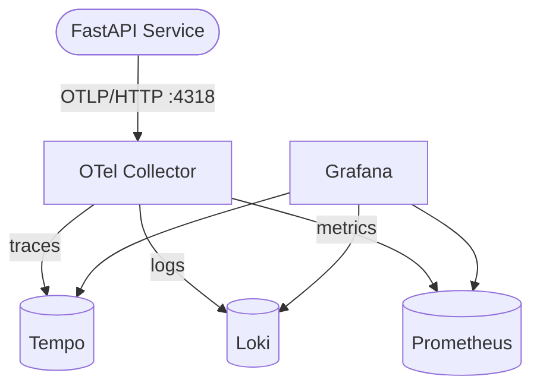
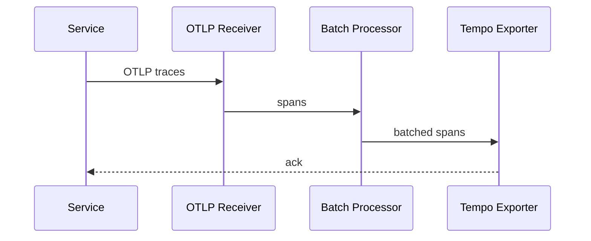

# How-To: Diagramas Mermaid

Guía para crear y mantener los diagramas Mermaid del proyecto. Cada diagrama es un archivo `.md` independiente con un bloque `mermaid` embebido — nunca archivos `.mmd` sueltos.

## Ubicación y naming

- Todos los diagramas viven en `docs/diagramas/`.
- Nombres en kebab-case: `stack-architecture.md`, `otlp-pipeline.md`, `tail-sampling-flow.md`.
- Un concepto por archivo. Si hay dos ideas distintas, dos archivos separados.
- Cada diagrama nuevo se agrega como fila en `docs/diagramas/index.md`.

## Tipos permitidos

| Tipo | Cuándo usarlo |
|------|---------------|
| `graph TD` / `graph LR` | Arquitectura general, dependencias entre servicios, flujos de datos |
| `sequenceDiagram` | Flujos request/response, interacciones entre receivers/processors/exporters |
| `flowchart LR` o `flowchart TD` | Pipelines del collector, árboles de decisión (sampling, routing) |
| `erDiagram` | Modelos de datos cuando aplique (raro en este repo) |

## Estructura del archivo

Cada archivo de diagrama sigue esta estructura fija:

```markdown
# {Nombre Descriptivo} — opentelemetry

Una oración que explica QUÉ muestra este diagrama.

\`\`\`mermaid
graph TD
    A[Node] --> B[Node]
\`\`\`

## Notas

Aclaraciones breves en español. Solo incluir si hay algo no obvio desde el diagrama.
```

## Reglas

- Máximo 20 nodos por diagrama — si se vuelve más grande, dividir en dos.
- Labels de nodos siempre en **inglés** (los comentarios y `## Notas` van en español).
- Sin colores custom (`style`, `classDef`) — dejar el tema por defecto del renderer.
- Sin `click` links — los diagramas son estáticos.
- Sin imágenes externas — solo sintaxis Mermaid nativa.
- Una idea por diagrama; si hay dos conceptos, dos archivos.
- La sección `## Notas` es opcional — omitirla si el diagrama se explica solo.

## Ejemplos

### graph TD — topología simple



### sequenceDiagram — pipeline interno


