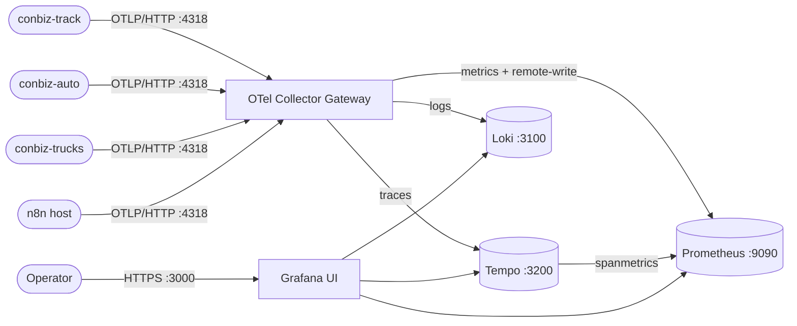

# Stack Architecture — opentelemetry

Topología del Compose stack `observability`: cómo entran los datos por el gateway, cómo se reparten a cada backend y qué expone Grafana al usuario.

## Notas

- Sólo `:4318` (gateway OTLP/HTTP) y `:3000` (Grafana) están bind a `0.0.0.0`. El resto queda en `127.0.0.1`.
- `spanmetrics` en el gateway genera RED metrics derivadas de los spans y las publica a Prometheus vía remote-write — por eso Prometheus tiene una flecha desde Tempo en los dashboards lógicos, aunque físicamente las series viajan por el gateway.
- Cada servicio cliente corre un OTel Agent local que reenvía al gateway. Este diagrama omite ese hop para mantener foco en el stack central.
